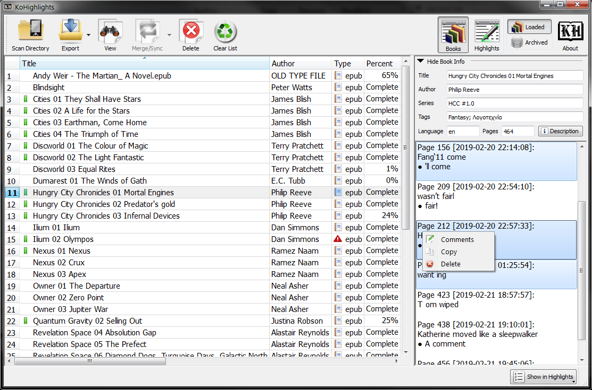
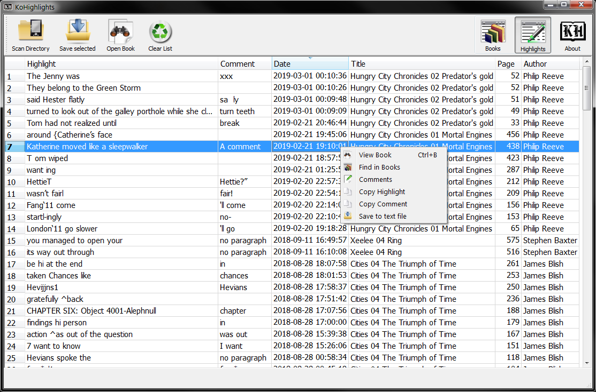

## General

[![made-with-python][Python]](https://www.python.org/)
[![Generic badge][OS]][ReleaseLink]
[![License: MIT][MIT]](LICENSE)
[![GitHub release][Release]][ReleaseLink]
<!-- [![Github all releases][TotalDown]][ReleaseLink] -->
<!-- [![Github Releases (by Release)][VersionDown]][ReleaseLink] -->

**KOHighlights** is a utility for viewing and exporting the
[Koreader](https://github.com/koreader/koreader)'s highlights to simple text, html, csv or markdown files.  

___
#### Screenshots

  
  
  
  
<!-- 

 -->
  
  
  
  

<!--  -->
<!--  -->
<!--  -->

___

# [Full User Guide and Documentation](https://noembryo.github.io/KoHighlights/)
___

## Usage/Features at a glance

* Load items by:
    * Selecting the reader's drive or any folder that contains books that where opened with Koreader. This will automatically load all the metadata files from all subdirectories.
    * Drag and drop files or folders. This will load the files and/or all the files inside the folders.  
* Export the highlights of the selected books to individual files or to one merged file.
* Supported formats for exporting:
    * Plain text files (.txt)
    * Hypertext document files (.html)
    * Comma-separated values files (.csv)
    * Markdown files (.md)
* View the highlights and various info for a book by selecting it in the list.
* Save the highlights to the "Archive" database and view them, even if your reader is not connected.
* Merge highlights/Sync position from the same book that is read in different devices and/or sync its reading position.
* Merge highlights/Sync position of a book with its archived version.
* Show/hide the page, date, chapter or even the highlight (!) text while viewing or exporting the highlights of the books. 
* Double click or press the Open Book button to view the book in your system's reader.
* Delete some or all the highlights of any book.
* Clear/reset the .sdr folders with the metadata or the books in the eReader.

### Prerequisites  
The progress sync plugin must be enabled in KOReader

### Portable
In Windows, KOHighlights can run in Portable mode using a `portable_settings` directory to store its settings, that is located inside the installation directory of the app.  
Because of this, it is advised to not install the app inside the default `Program Files` folder if you indent to use it as portable.  
There are two ways to start the app in Portable mode:
* Run the `KoHighlights Portable.exe` that is located next to the `KoHighlights.exe`.  
* Run `KoHighlights.exe` with a `-p` argument.  
E.g. create a shortcut for the `KoHighlights.exe` and add a space and a `-p` argument at the end of the target filename.

## Downloads
Check the latest release on the [Downloads Page][ReleaseLink].  
Read the version history at [App's Page](http://www.noembryo.com/apps.php?kohighlights).

## Dependencies
* **Source code:**  
Should run in any system with Python 3.6+ (more testing required)  
It needs the [PySide2](https://pypi.org/project/PySide2/),
[BeautifulSoup4](https://pypi.org/project/beautifulsoup4/),
[packaging](https://pypi.org/project/packaging/) and
[requests](https://pypi.org/project/requests/) libraries.  
In Windows, it might also need the [PyWin32](https://pypi.org/project/PyWin32/) and the [Pypiwin32](https://pypi.org/project/pypiwin32/) libraries.
PySide6 is also supported (download the archive from the releases)
* **Compiled binaries:**  
  * ***Windows***:  
  From version 2.x, KOHighlights dropped support for Windows XP.  
  Can run on any version of Windows from Windows 7 upwards.  
  For Windows 7, Microsoft Visual C++ 14.0 is required. Get it 
  [here](https://aka.ms/vs/17/release/vc_redist.x86.exe).  
  The Windows 7 32bit version also needs the KB2533623 update that is included in [KB3063858](https://www.microsoft.com/en-us/download/details.aspx?id=47409) ([direct link](https://download.microsoft.com/download/C/9/6/C96CD606-3E05-4E1C-B201-51211AE80B1E/Windows6.1-KB3063858-x86.msu)).  
  * ***Linux***:  
  The binary is compiled using Xubuntu 18.04.  
  Any newer version should work.
  

## Extra
KOHighlights includes SLPPU (a converter between python and lua objects).  
If you want it to be globally available, get it from its
[GitHub's page](https://github.com/noembryo/slppu) or install it with:  
`pip install git+https://github.com/noembryo/slppu`  

<!-- ##### Stargazers over time

 -->

[Release]:https://img.shields.io/github/release/noembryo/KoHighlights.svg
[ReleaseLink]:https://GitHub.com/noembryo/KoHighlights/releases/
[TotalDown]:https://img.shields.io/github/downloads/noembryo/KoHighlights/total.svg
[VersionDown]:https://img.shields.io/github/downloads/noembryo/KoHighlights/v1.2.2.0/total.svg
[Python]:https://img.shields.io/badge/Made%20with-Python-1f425f.svg
[OS]:https://img.shields.io/badge/OS-Windows&nbsp;/&nbsp;Linux-darkgreen.svg
[MIT]:https://img.shields.io/badge/License-MIT-green.svg
